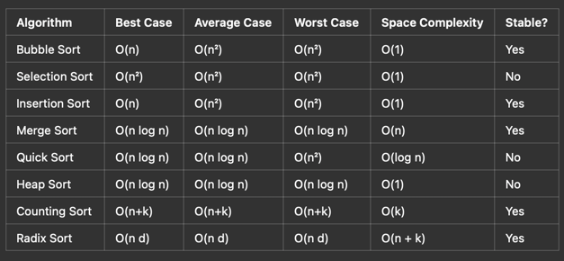

# SortingAlgorithms

### Two basic operations in sorting algorithms

- comparision
- Exchange/Swap


- Example ot comparision

```if arr[j] < arr[min_index]: ```

- Example of Exchange/Swap

```

 arr[i], arr[min_index] = arr[min_index], arr[i]
 
 or 
 
 
temp = arr[i]
arr[i] = arr[min_index]
arr[min_index] = temp
```


Design Strategy #1: Brute Force Comparison
    - Selection Sort algorithm
    - Bubble sort algorithm
Design Strategy #2: Decrease and Conquer (lazy manager approach)
    - Decrease the given problem of size n to size n-1
        - n
        - upfront work to nibble away one element from the given input. n --> n-1
        - work at the end to extend the (n-1)st solution n-1 --> n = Insertion sort algorithm


### Brute force Selection Sorting

Selection Sort is a straightforward brute-force algorithm that sorts an array by repeatedly selecting the smallest (or
largest) element and placing it in its correct position. It is an inefficient sorting technique with O(n²) time
complexity, but its simplicity makes it useful for small datasets.

To get the minimum elements one by one, selection sort scans the array from left to right and keeps track of the next
minimum.

1. How Selection Sort Works
    1. Find the smallest element in the array.
    2. Swap it with the first element.
    3. Repeat the process for the remaining subarray (excluding the first element).
    4. Continue this until the entire array is sorted.

Time Complexity Analysis

	•	Best-case:  O(n^2)  (even if already sorted)
	•	Worst-case:  O(n^2)  (when sorted in reverse)
	•	Average-case:  O(n^2) 

Why?

	1.	The outer loop runs  n  times.
	2.	The inner loop runs  (n-1), (n-2), (n-3), ..., 1 , 
    which sums up to:n(n-1)/2 = O(n^2)

Space Complexity

	•	O(1) (Only a temp variable is used for swapping, making it an in-place algorithm).

## Brute force Bubble sort
- we could have sort the array from right to left, and bubbled up the minimum to the left by repeated exchanges
- Bubble Sort is a simple brute-force sorting algorithm that repeatedly swaps adjacent elements if they are in the wrong order. It continues passing through the list until it is fully sorted.


1. How Bubble Sort Works
	1.	Compare adjacent elements in the list.
	2.	Swap them if they are in the wrong order.
	3.	Repeat the process for every element until the list is sorted.
	4.	Each pass moves the largest unsorted element to its correct position at the end.

Complexity Analysis

	•	Best-case:  O(n)  (already sorted with no swaps).
	•	Worst-case:  O(n^2)  (reverse sorted, maximum swaps needed).
	•	Average-case:  O(n^2) .

Space Complexity

	•	O(1) (Only uses a temporary variable for swapping, making it an in-place sorting algorithm).
### Decrease and Conquer (lazy manager approach)
    - Decrease the problem of size n to size n - 1
    - Assume you have solved the problem of size n-1
    - Solve the problem of size n using the solution to the problem of size n-1
    - Recursive (Top down approach) and iterative (Bottom up approach)


## Note
- in selection and bubble sort we make use of for 
- in insertion sort we make use of while looping

# Summary of Sorting Algorithms

